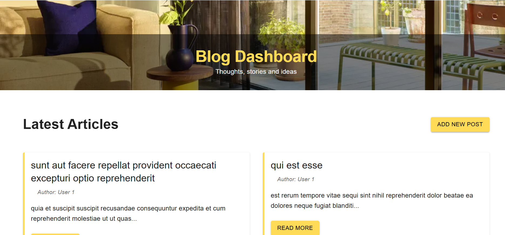

# Blog Dashboard with Next.js, MUI, and RTK Query

 *(Add screenshot later)*

A responsive blog dashboard built with Next.js, Material-UI, Redux Toolkit Query, and TypeScript. 

## Local Setup

### Prerequisites
- Node.js v16+
- npm or yarn
- Git

### Installation
1. Clone the repository:
   ```bash
   https://github.com/haniasalman/Blog-Dashboard.git
   cd blog-dashboard
2. Install dependencies:
   ``` bash
   npm install
   # or
   yarn install
3. Run the development server:
   ``` bash
   npm run dev
4. Open http://localhost:3000 in your browser

### Technical Stack
- Next.js 13
- Material-UI (MUI) for UI components
- RTK Query for data fetching/caching
- TypeScript
- Vercel for deployment ([Link to the app](https://blog-dashboard-sage.vercel.app/))


### Design Decisions
#### 1. Architecture Choices
- **App Router**: Used Next.js 13's modern router for better performance
- **Client Components**: Isolated data-fetching logic in client components
- **Modular Structure**: Separated API logic, components, and features

#### 2. UI/UX Implementation
- **Responsive Layout**: MUI Grid + custom hooks for device detection
- **Color Scheme**: Mustard (#FFDB58) as primary with black/white
- **Loading States**: Skeleton UI during data fetching
- **Error Handling**: User-friendly error messages with retry options

#### 3. State Management
- **RTK Query**: Chosen over React Query for Redux integration
- **Cache Tags**: Implemented providesTags/invalidatesTags for auto-refetch
- **Optimistic Updates**: Future enhancement possibility

### Challenges Faced
#### 1. Hydration Mismatches
- Console errors due to SSR/Client component differences  
#### 2. RTK Query Cache Management
- New posts weren't appearing in lists. Mock APIs return fake data but don’t save changes permanently. 
- JSONPlaceholder (mock API) doesn’t persist created posts.
#### 3. Responsive Layout Shifts
- UI elements jumping around on different screen sizes
- CSS loading flashes as it was showing unstyled raw HTML (big headers, no colors)
#### 4. Dynamic Route Params
- TypeScript errors when trying to access URL parameters like /posts/1 (where 1 is a post ID)